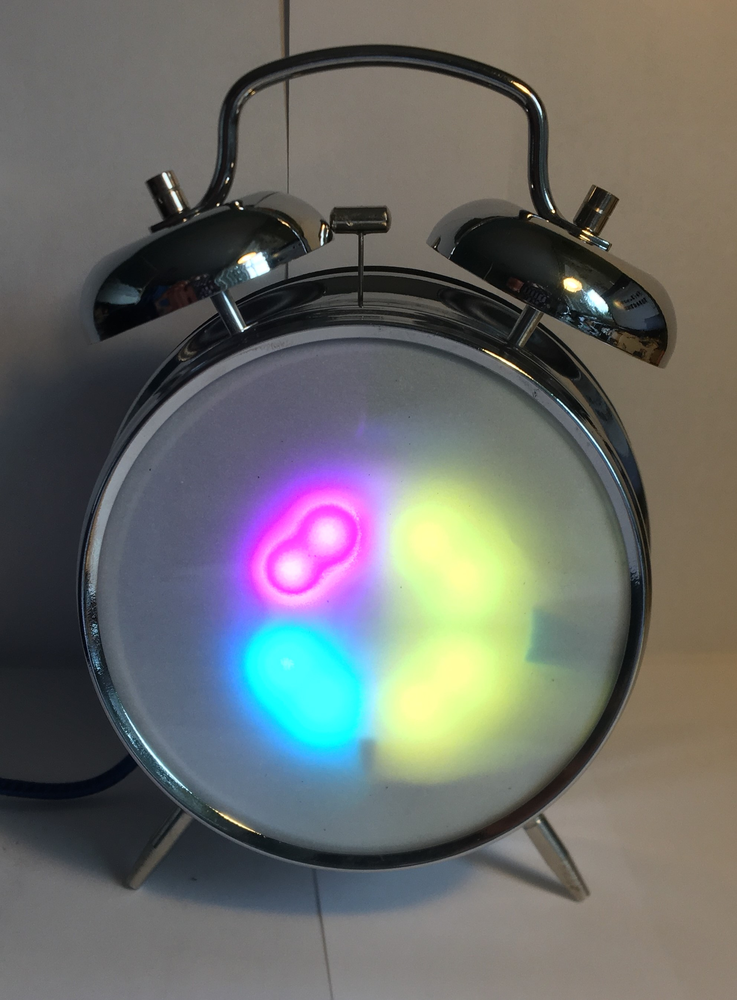

# Binary (Base 2) Alarm Clock

### Conversion of a classic two-bell alarm clock into a futuristic binary (base 2) clock using a Circuit Playground Express and an Equity #13014

### Parts and Materials
- Equity Two Bell Alarm Clock (#13014)
- 1Hz Timebase Circuit (taken from a clock circuit) - although I used a different circuit, you probably can adapt the one from the clock

- Circuit Playground Express
- Right-angle Micro USB to USB Type A Cable
- 5V USB Phone Charger
- Electronic components and wire as shown in the [wiring diagram](/Assembly/Wiring.pdf) and [BOM](/Assembly/BOM.csv)
- Files, screwdrivers, and soldering equipment
- Double sided tape and glue
- Three circle of vellum paper the same size as the alarm clock's face (3 13/16 inches)

### Software Setup
To setup your Circuit Playground Express, please see the Adafruit website. For this project, you will need to be able to upload code to it via the Arduino IDE.

Open the file main.ino in Arduino and upload it to the Circuit Playground Express.

### Hardware Setup

#### Disassembly
Dismantle the alarm clock by removing the screws on the back as shown in the picture below. Then continue to remove parts from it until only the metal shell is left. Also, desolder the connections to the clock mechanism and put it aside, marking which wires are for positive, negative and signals; we will be using it later to connect.

There's an excellent guide on iFixit if you need more complete instructions for [disassembling it](https://www.ifixit.com/Guide/Equity+Alarm+Clock+13014+Clock+Hands+Replacement/33113).

#### Modifications
You will need to file the inner case to make it large enough so that the wires will all fit easily. Also, it is helpful to file a slot for the USB cable to go through in the front of the main plastic part. Finally, create a hole in the back of the case for the USB cable. Please see the picture below for where and how much to remove:

#### Creating the Timer Circuit
To create the timer circuit, first disassemble the clock case (there are three tabs that you'll need to pry up to get the lid off). Then remove the gears and other parts until you have the circuit separated.

Next, solder up the circuit at shown in the wiring diagram with the connections highlighted below to the left. The diodes need to be connected to the coil output, and the power wires need to be connected to the resistors:

#### Wiring
Solder together the Circuit Playground Express board as shown below (reference the pictures with the <a href="/Assembly/Wiring.pdf">Wiring diagram</a>)

Next, glue in the switches as shown below and solder them up.

Then, solder up the motor and alarm switch using the original wire.

Finally, solder up the rest of the project as shown below and in the wiring diagram.

#### Final Assembly
Now attach the Circuit Playground Express to the front with double sided tape. Plug in the USB cable, and route it through the case and out the hole in the back.

Place the three circles of vellum on the glass, and put the assembly inside of the metal case.

Finally, reassemble the clock as it was taken apart, making sure no wires are trapped in the mechanism.

### Usage

#### Reading the clock
The clock displays numbers in a binary pattern, with the top-left quadrant representing 1 and the bottom-right quadrant representing 8. The values increase in powers of two from left to right:
| Clock | quadrants |
| --- | --- |
|  1  |  2  |
|  4  |  8  |

| 8:35 | 10:40 | 11:30 | 17:55 |
|:----:|:-----:|:-----:|:-----:|
|  |  |  |  |

The colors represent the hours, minutes or both. The mnemonics RGB and CMY can be used to remeber which color is which time - red and cyan are hours, green and magenta are both, and blue and yellow are minutes. RGB is used for AM, whereas CMY represents PM.

#### Setting and resetting the time and alarm
Please see the table below for the various functions available. The change the times (current or alarm), first enter the time setting mode as instructed below. Then use the two buttons to increment the hours and minutes.

| Action                      | Function                                              |
|-----------------------------|-------------------------------------------------------|
| Both buttons, 1 second      | Set the current time (LEDs flash green)               |
| Both buttons, 2-3 seconds   | Set the alarm time, (LEDs flash blue)                 |
| Both buttons, 4 seconds     | Reset all times to their default (disables the alarm; LEDs flash red) |
| Either buttons, 1 second    | Briefly raise the brightness of the clock             |

#### Extra Functionalities
The switch on the back is provided to disable the alarm. Keep in mind that this is connected directly to the motor, so the alarm will not sound again until you flip the switch back.

### License
Copyright (C) 2020  PolarPiBerry
All work is licensed under the GNU General Public License (see LICENSE)
